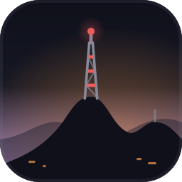
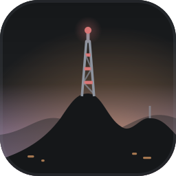

<p align="center">
  <a href="https://sp-night.github.io">
    
  </a>
</p>

<h1 align="center">SP Night</h1>

<p align="center">
  <strong>The sodium lamp turns the whole city this colour.</strong><br>
  A dark colour scheme with São Paulo as its reference — the sodium street lamp,<br>
  exposed concrete, the free span of the MASP, the drizzle before the rain.
</p>

<p align="center">
  <a href="https://github.com/sp-night/sp-night.github.io/actions/workflows/deploy.yml"></a>
  
  
  
</p>

<p align="center">
  <a href="https://sp-night.github.io"><strong>sp-night.github.io</strong></a>
  &nbsp;·&nbsp;
  <a href="https://sp-night.github.io/palette">palette</a>
  &nbsp;·&nbsp;
  <a href="https://sp-night.github.io/spec">spec</a>
  &nbsp;·&nbsp;
  <a href="https://sp-night.github.io/ports">ports</a>
  &nbsp;·&nbsp;
  <a href="https://sp-night.github.io/contribute">contribute</a>
</p>

---

## The flavours

All three are dark, by decision. They differ in hue and chroma, never in brightness —
nothing gets easier or harder to read when you switch.

<table>
  <tr>
    <td align="center" width="33%"></td>
    <td align="center" width="33%"></td>
    <td align="center" width="33%"></td>
  </tr>
  <tr>
    <td align="center"><strong>Noite Paulista</strong> <code>noite</code></td>
    <td align="center"><strong>Garoa</strong> <code>garoa</code></td>
    <td align="center"><strong>Pico do Jaraguá</strong> <code>jaragua</code></td>
  </tr>
  <tr>
    <td align="center">The city at 3&nbsp;a.m. A blue-violet dark, with the sodium street lamp burning warm on top of it.</td>
    <td align="center">The same window, seen through the drizzle. Flat grey — the garoa does not cool the city down, it fades it out.</td>
    <td align="center">The same night, seen from the highest point in the city. Near-black, the forest left to the accents.</td>
  </tr>
</table>

## The palette

Five surfaces · three levels of text · eight accents · six bright pairs — 22 colours,
each named after the thing in São Paulo it came from. Every pairing is measured before
it ships, never eyeballed.

**noite**


**garoa**


**jaragua**


Full detail — glosses, OKLCH, WCAG ratios, the ANSI map — lives at
[sp-night.github.io/palette](https://sp-night.github.io/palette).

<!-- palette-table:start -->
<details>
<summary>The 22 hex values, all three flavours</summary>

| colour | `noite` | `garoa` | `jaragua` |
| --- | --- | --- | --- |
| `vao` | `#0f101a` | `#151719` | `#050806` |
| `laje` | `#151723` | `#1c1e20` | `#0c100d` |
| `concreto` | `#1d1f2d` | `#26282a` | `#151a17` |
| `vidro` | `#272937` | `#313436` | `#202622` |
| `fiacao` | `#373943` | `#414346` | `#323733` |
| `fg` | `#d3d7eb` | `#c7cdd6` | `#d3dad5` |
| `fg_dim` | `#868999` | `#8d949f` | `#868b87` |
| `fg_muted` | `#707380` | `#767d88` | `#707471` |
| `brasa` | `#ea5d5d` | `#d87676` | `#ea5d5d` |
| `sodio` | `#f2984a` | `#e3a068` | `#f2984a` |
| `taxi` | `#f5c66b` | `#e7cb8a` | `#f5c66b` |
| `ibira` | `#89d093` | `#9acaa2` | `#79d488` |
| `estaiada` | `#38b59e` | `#56b19f` | `#05b89e` |
| `sereno` | `#5dbec4` | `#77babf` | `#60bfb8` |
| `marginal` | `#6e92de` | `#7993cb` | `#6e92de` |
| `temporal` | `#b094e2` | `#af97d3` | `#b094e2` |
| `brasa_vivo` | `#ff716f` | `#ed8988` | `#ff716f` |
| `taxi_vivo` | `#ffdc9c` | `#fbdf9d` | `#ffdc9c` |
| `ibira_vivo` | `#9ce4a6` | `#addeb5` | `#8ce99b` |
| `sereno_vivo` | `#71d1d7` | `#8acdd2` | `#73d2cb` |
| `marginal_vivo` | `#80a5f2` | `#8ba6df` | `#80a5f2` |
| `temporal_vivo` | `#c3a7f6` | `#c2aae7` | `#c3a7f6` |

</details>
<!-- palette-table:end -->

## Ports

One repository per themed app, each holding finished theme files — plain text, no
build step to use them. A port is listed only once it is published, so everything
below can be installed today. The registry is
[`resources/ports.yml`](resources/ports.yml) and the table is generated from it by
`npm run assets`.

<!-- ports-table:start -->
| Port | Group | Installs to |
| --- | --- | --- |
| [Ghostty](https://github.com/sp-night/ghostty) | Terminals | `~/.config/ghostty/themes/sp_night_{flavor}` |
| [eza](https://github.com/sp-night/eza) | Shell & CLI | `~/.config/eza/theme.yml` |
<!-- ports-table:end -->

Theming another app? See [CONTRIBUTING.md](CONTRIBUTING.md). The palette and the
role layer are published as data — [`/palette.json`](https://sp-night.github.io/palette.json)
and [`/roles.json`](https://sp-night.github.io/roles.json) — so the colour decisions
are already made and nothing needs to be copied by hand.

## This repository

The website. A static [Astro](https://astro.build) site, no UI framework. Colour data
is vendored in `src/data/` and flows through one typed module, `src/data/palette.ts`:

- **No component reads the JSON directly** — everything derives at build time.
- **No hex literal exists outside `src/data/`** — enforced by a test that scans the tree.
- The contrast policy (body text AAA on every surface, dim text AA, accents AA on the
  deepest background) is asserted in CI, so a palette drop that breaks it never deploys.

```sh
npm ci
npm run dev        # dev server
npm run check      # astro type-check
npm test           # vitest: colour maths, data shape, contrast policy, no-raw-hex rule
npm run build      # static build into dist/
npm run assets     # regenerate favicons, logos, OG cards, palette strips and the README tables
```

Every image in this README is generated from the palette by `npm run assets` —
if the colours change, the brand follows.

## Deploy

Push to `main` → `deploy.yml` runs type-check, tests and build, then publishes to
GitHub Pages. Other branches and PRs run the same checks via `ci.yml` without deploying.

## Updating the palette · adding ports

- Palette or roles change → replace `src/data/palette.json` / `src/data/roles.json`,
  run `npm test` (the contrast tests are the gate) and `npm run assets`.
- New port, or a port ships as its own repo → edit
  [`resources/ports.yml`](resources/ports.yml) (add the entry, or its `repo:` line)
  and run `npm run assets` to refresh the table above. The site and
  [sp-night.github.io/ports](https://sp-night.github.io/ports) read the same file
  at build time.

Contributions are welcome — see [`CONTRIBUTING.md`](CONTRIBUTING.md) for how to
propose a port or report a colour problem, and [`SITE.md`](SITE.md) for the full
design plan and decision log.

<p align="center">
  <sub>SP Night — built by <a href="https://github.com/sp-night/sp-night.github.io/graphs/contributors">its contributors</a> · MIT</sub>
</p>
